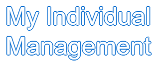
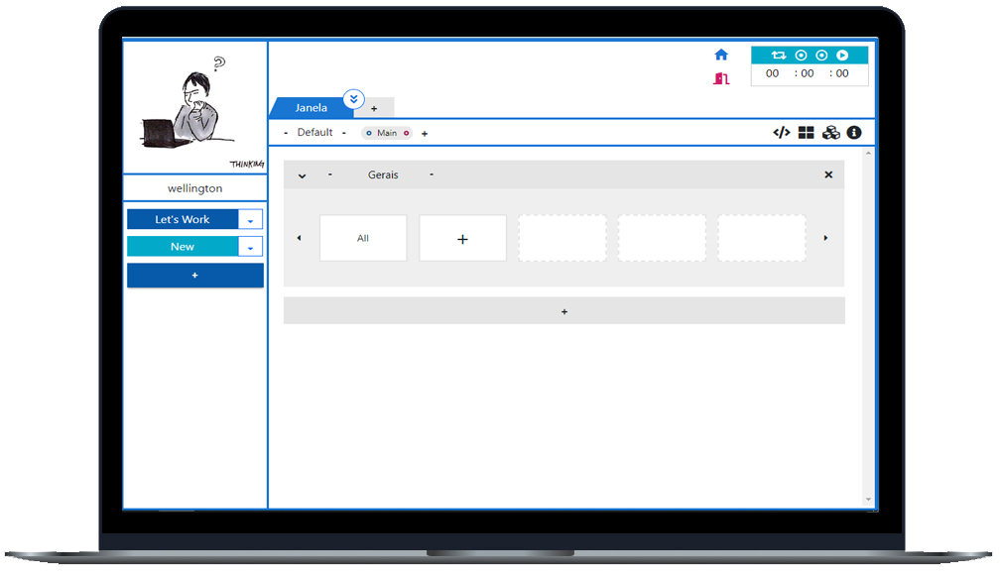

<h1 align="center">
  
</h1>

  <a href="#-tecnologias">Tecnologias</a>&nbsp;&nbsp;&nbsp;|&nbsp;&nbsp;&nbsp;
  <a href="#-projeto">Projeto</a>&nbsp;&nbsp;&nbsp;|&nbsp;&nbsp;&nbsp;
  <a href="#-layout">Layout</a>&nbsp;&nbsp;&nbsp;|&nbsp;&nbsp;&nbsp;
  <a href="#-como-executar">Como executar</a>&nbsp;&nbsp;&nbsp;|&nbsp;&nbsp;&nbsp;
  <a href="#-licença">Licença</a>

  

 

 

  

## ✨ Tecnologias

Esse projeto foi desenvolvido com as seguintes tecnologias:

- [Angular](https://angular.io/)
- [Spring Boot](https://spring.io/)
- [TypeScript](https://www.typescriptlang.org/)

## 💻 Projeto

O myIndividualManagement é um app que faz o gerenciamento de suas atividades de forma organizada para a melhor experiência do usuário.

## 🔖 Layout

Você pode visualizar o layout do projeto através da pasta prototipagem do próprio repositório.

## 🚀 Como executar

- Clone o repositório
- Verifique se a versão do node seja igual a 14.17.3 com: `nvm ls`
- Instale as dependências com `yarn install`
- Inicie o servidor com `yarn start`

Agora você pode acessar [`localhost:4200`](http://localhost:4200) do seu navegador.

## 📄 Licença

Esse projeto está sob a licença MIT. Veja o arquivo [LICENSE](LICENSE.md) para mais detalhes.

---

Feito com ♥ by WellingtonPLF 👋🏻 [Contact Me 😊](https://mail.google.com/mail/?view=cm&fs=1&to=wellplf@gmail.com)